## 🧠 Smart Companion

**Bridging the executive function gap with neuro-inclusive AI.**

An AI-powered productivity assistant built for neurodivergent minds. Break overwhelming tasks into tiny **Micro-Wins** one step at a time.

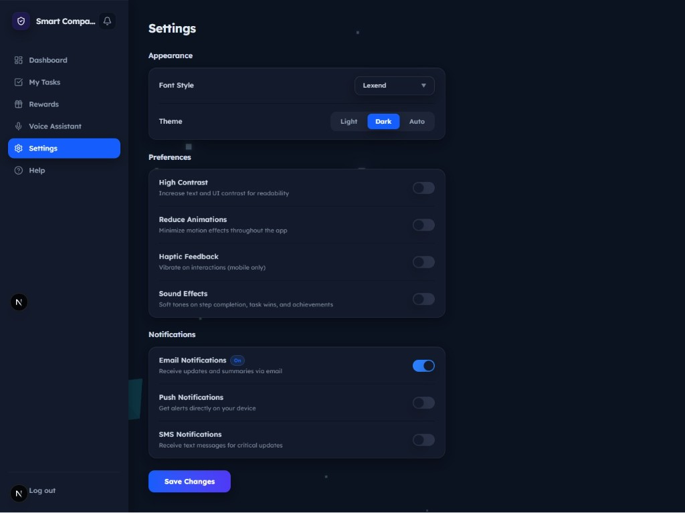

---

## 🌟 Overview

Smart Companion is an intelligent productivity assistant designed to help neurodivergent individuals stay focused, organized, and motivated. Instead of presenting large, intimidating tasks, the app breaks them down into manageable **Micro-Wins**, making progress feel achievable and rewarding.

Whether you're dealing with ADHD, executive dysfunction, procrastination, or task overwhelm, Smart Companion provides gentle guidance and actionable next steps to keep you moving forward.

Built with **Next.js 16**, **React 19**, **TypeScript**, **Tailwind CSS**, **Supabase** (auth + database), **Groq/OpenAI** for AI step generation, **Three.js** for ambient visuals, and **Vapi AI** for voice input.

---

## 🚀 Getting Started

```bash
# Install dependencies
npm install

# Run the development server
npm run dev
```

Open [http://localhost:3000](http://localhost:3000) in your browser.

---

## About

🖇️ https://thesmartcompanion-gcrd.vercel.app/

## 📸 Screenshots

The images below follow the user journey — marketing site → login → onboarding → daily use → admin panel. Each caption reflects what the code in `src/` actually implements.

---

### 1. Public Marketing Site

#### Hero Banner


Project branding graphic summarizing the four pillars the app is built around: breaking overwhelming tasks into micro-steps, supporting time blindness, dyslexia-friendly reading, and reducing decision fatigue — for ADHD, autism, and dyslexia.

#### Landing Page (`/`)

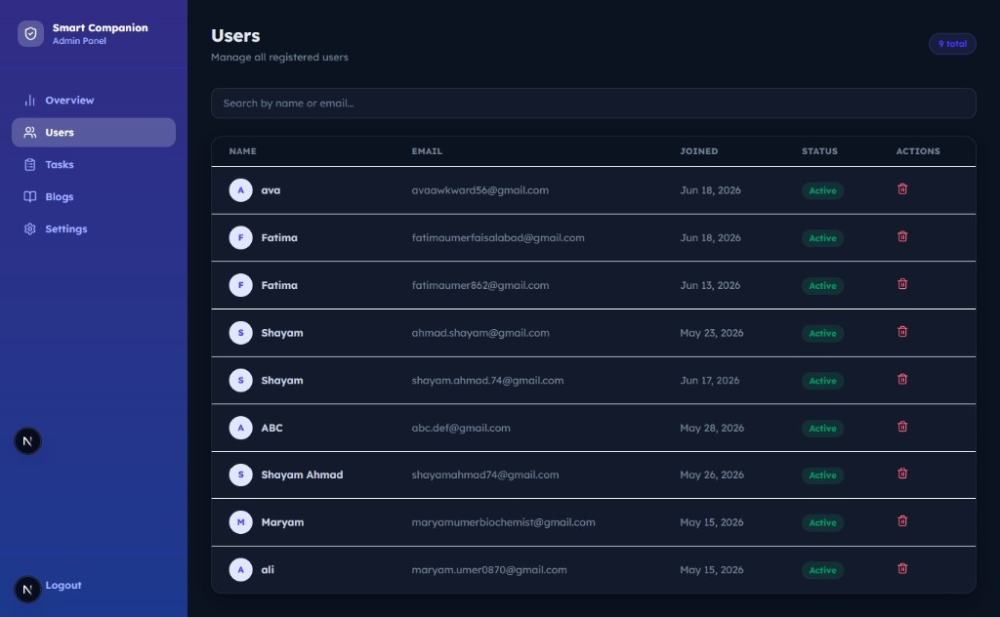

The root route renders `Navbar`, `Hero`, and `Features`. The hero (`Hero.tsx`) shows the tagline *"Your AI Companion for Everyday Wins"*, a **Get Started** link to `/login`, and a Three.js `HeroScene`. Below it, the **Challenges We Help With** grid (`Features.tsx`) lists Task Paralysis, Time Blindness, Reading Difficulty, and Decision Fatigue.

#### Features Page (`/features`)

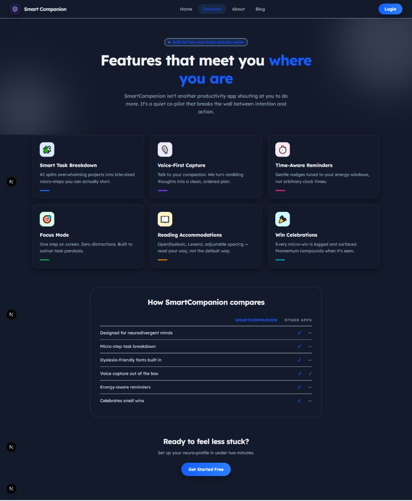

Dedicated features route with six cards defined in `features/page.tsx`: Smart Task Breakdown, Voice-First Capture, Time-Aware Reminders, Focus Mode, Reading Accommodations, and Win Celebrations. Includes a **How SmartCompanion compares** table and a CTA linking to `/login`.

#### About Page (`/about`)

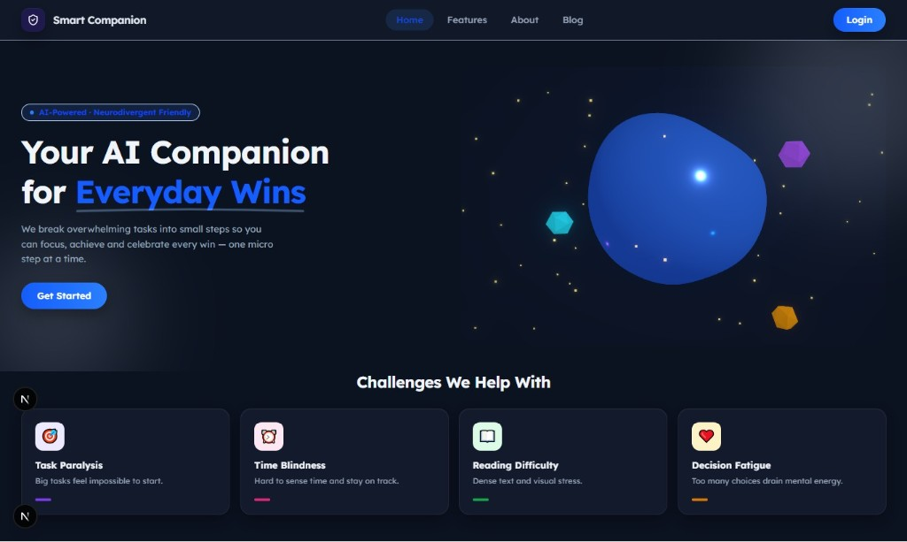

Static about page with the founder story (*"We're building the tool we wished existed"*), mission statement (*"Make starting easier than scrolling"*), stats (12k+ signups, 84% fewer freeze moments, 4.8★ rating), and four values: Built with not for, Soft by default, Your data is yours, and Evidence over hype.

#### Blog (`/blog`)

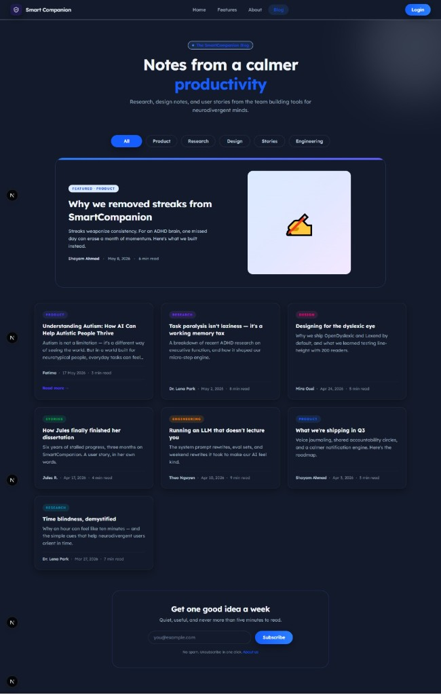

Blog page that merges **published posts from Supabase** (`blogs` table) with static seed articles. Category filters (All, Product, Research, Design, Stories, Engineering), a featured post on removing streaks, and a newsletter signup footer.

---

### 2. Authentication (`/login`)

#### User Login

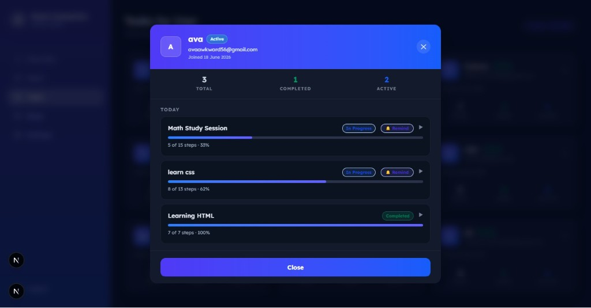

Single login page with a **User Login / Admin Login** toggle. User mode uses **Supabase** email/password auth and **Google OAuth**. On success it syncs tasks, stores the profile in `localStorage`, and routes to `/profilesetup` (new users) or `/dashboard` (returning users). Includes forgot-password flow via Supabase reset email.

#### Admin Login

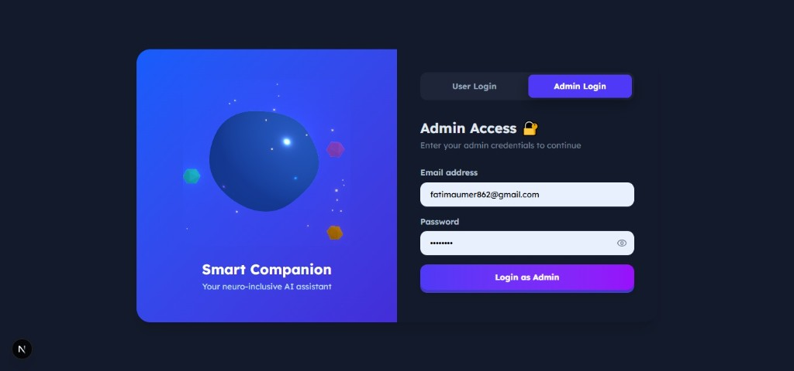

Same `/login` page in **Admin Login** mode. Validates against hardcoded admin credentials and redirects to `/admin/overview`. Google OAuth and sign-up links are hidden in this mode.

---

### 3. Onboarding (`/profilesetup`)

#### Neuro-Profile Setup

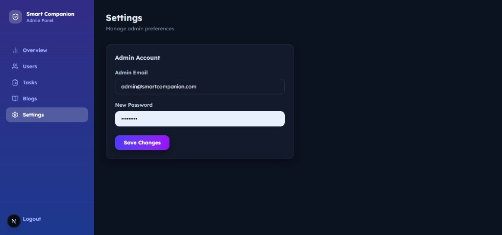

First-time setup after sign-up. Users pick a **neurotype** (ADHD, Dyslexia, Autism, Other), **step size** (Very Small → 8–9 micro-steps, Normal → 4–6, Detailed → up to 10), and a **reading font** (Default, OpenDyslexic, Lexend). Choices are saved to `localStorage` as `preferences` (including a `stepSizeInstruction` for the AI) and `profile_completed: true` is written to Supabase before redirecting to `/dashboard`.

---

### 4. User Dashboard & Task Management

#### Dashboard (`/dashboard`)

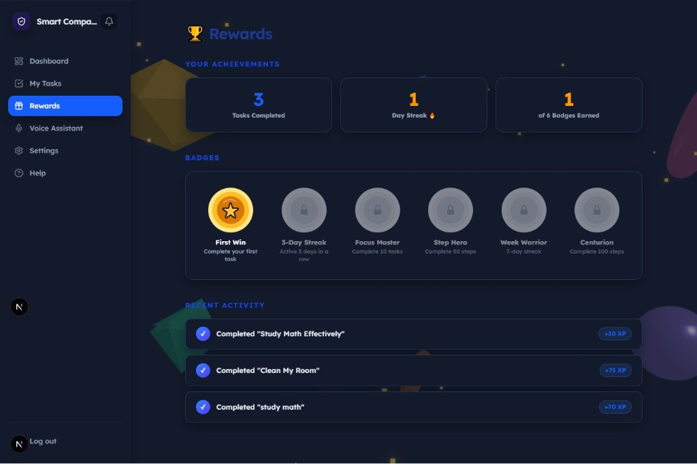

Main hub wrapped in `Sidebar` + `ProgressCard`. Users type a task and click **Break into Steps**, which POSTs to `/api/generate-steps` with their neurotype and step size from preferences. The mic icon links to `/voice-assistant`. Generated tasks are saved via `saveTask()` and the user is sent to `/taskinfo` to work through steps. **Today's Tasks** lists only tasks created today, sorted with incomplete first.

#### My Tasks (`/mytask`)

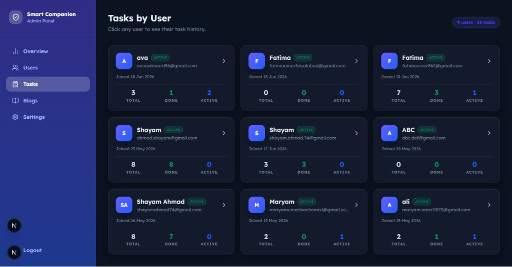

Full task archive with a step-completion ring, stats strip (Total / Completed / In Progress), and the same AI **Generate Steps** flow as the dashboard. Tasks are grouped into **Today** and **Previous** sections (by `createdAt` date). Each `TaskCard` shows category badges (Personal, Study, Work, Health), segmented step progress, and delete support.

#### Task History (modal on Dashboard)

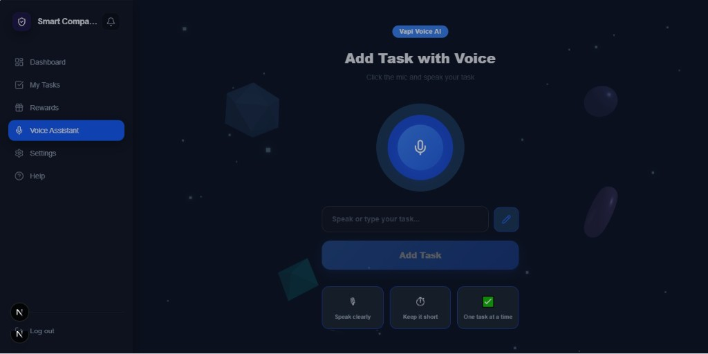

Opened via **History →** on the `ProgressCard` component. Groups all tasks by day and shows how many were fully completed that day (e.g. *2 of 3 tasks completed — 67%*). Today's bar reflects the same logic as the progress card on the dashboard.

---

### 5. Gamification (`/rewards`)

#### Rewards

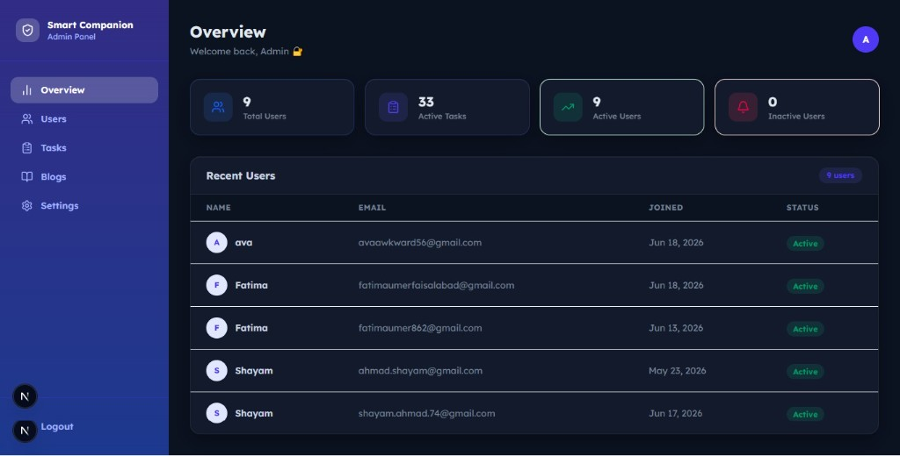

Tracks **Tasks Completed**, **Day Streak** (consecutive days with task activity), and badges earned out of six: First Win, 3-Day Streak, Focus Master (10 tasks), Step Hero (50 steps), Week Warrior (7-day streak), and Centurion (100 steps). **Recent Activity** logs completed tasks with XP (+5 per step in the task).

---

### 6. Accessibility & Support

#### Voice Assistant (`/voice-assistant`)

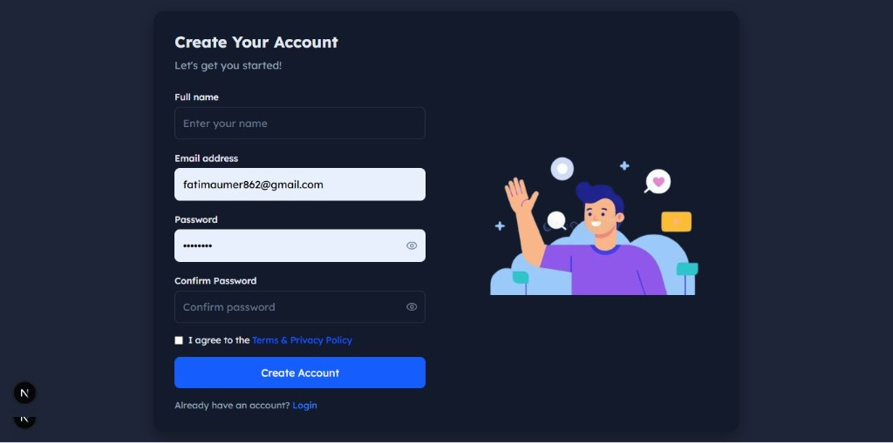

Uses the **Vapi AI** hook (`useVapi`) for live speech-to-text with a pulsing mic UI. Spoken or typed tasks are sent to `/api/generate-steps` and the user is redirected to `/taskinfo` — the same pipeline as the dashboard, just voice-first.

#### Settings (`/setting`)

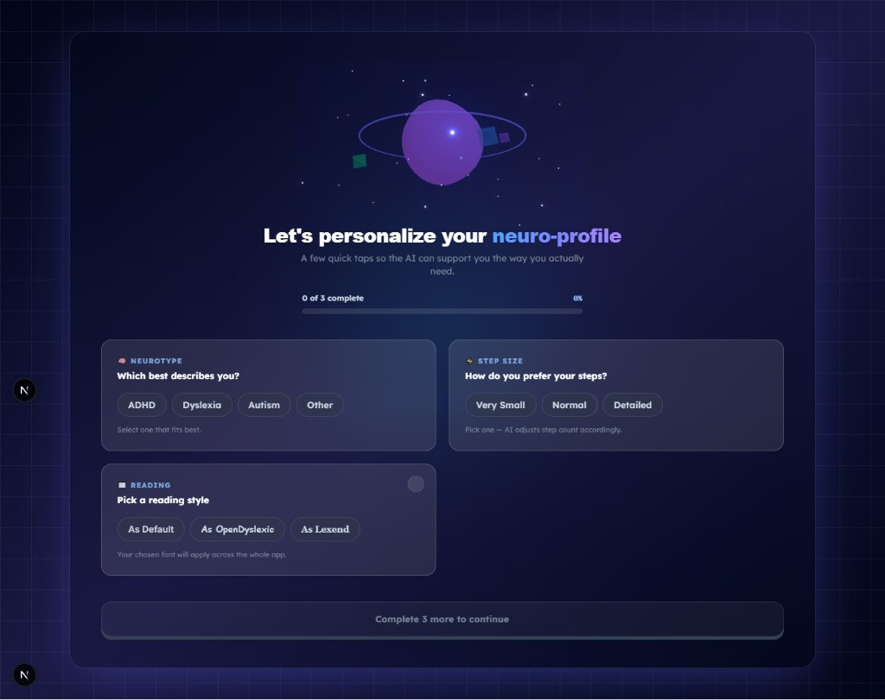

Persists to Supabase `user_settings` on **Save Changes**. Controls: font (OpenDyslexic, Inter, Roboto Mono, Lexend, System Default), theme (Light / Dark / Auto), high contrast, reduce animations, haptic feedback, sound effects (via `gamification.ts`), and notification toggles for email, push, and SMS.

#### Help (`/help`)

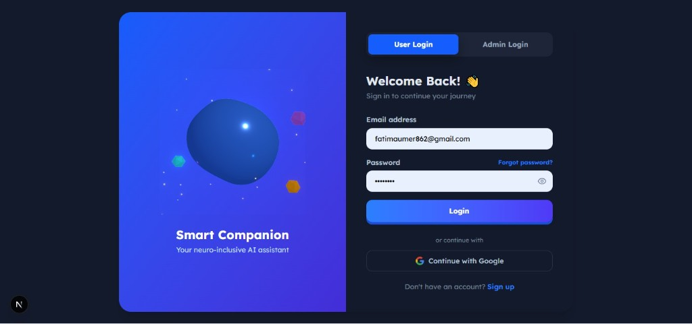

Searchable FAQ accordion with five topics from `help/page.tsx`: creating tasks, how AI breakdown works, customizing your experience, privacy, and voice commands. Includes a **Contact Support** banner at the bottom.

---

### 7. Admin Panel (`/admin`)

#### Overview (`/admin/overview`)

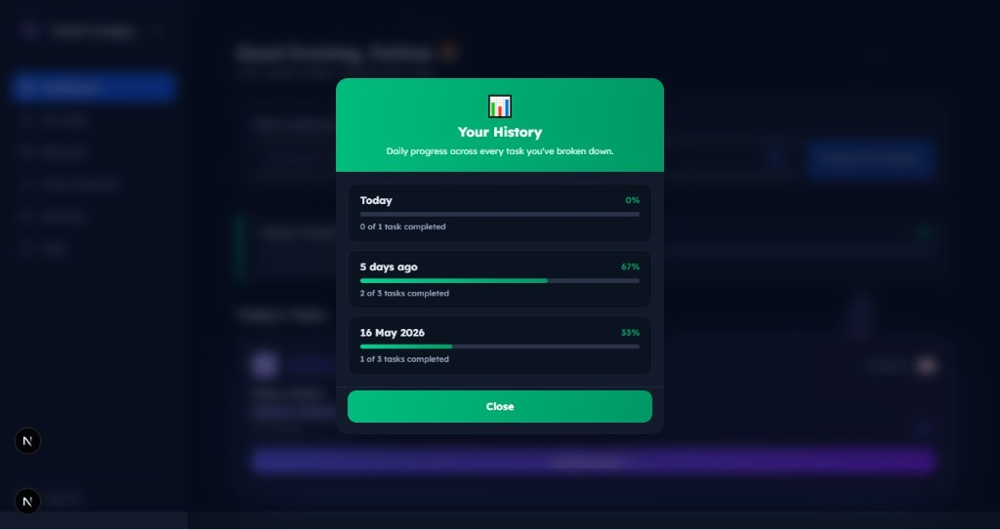

Admin landing page fetching data via `supabaseAdmin`. Shows four stat cards — Total Users, Active Tasks (count from `tasks` table), Active Users, Inactive Users — plus a **Recent Users** table (latest 5 from the `users` table with name, email, join date, and status).

#### Users (`/admin/users`)

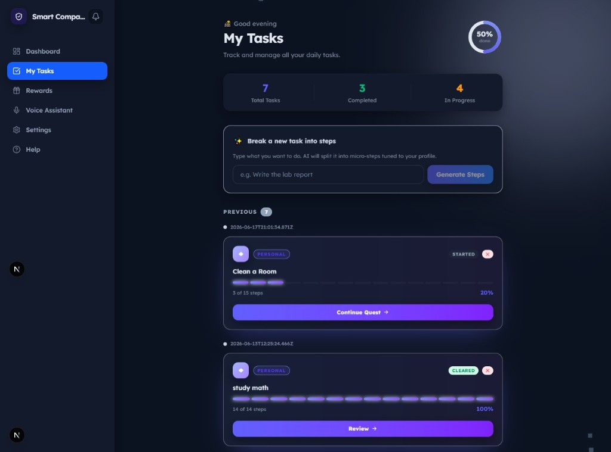

Searchable user table. Admins can **toggle Active/Inactive** status (click the status badge) or **delete** a user (trash icon). Data is loaded from Supabase `users`.

#### Tasks by User (`/admin/tasks`)

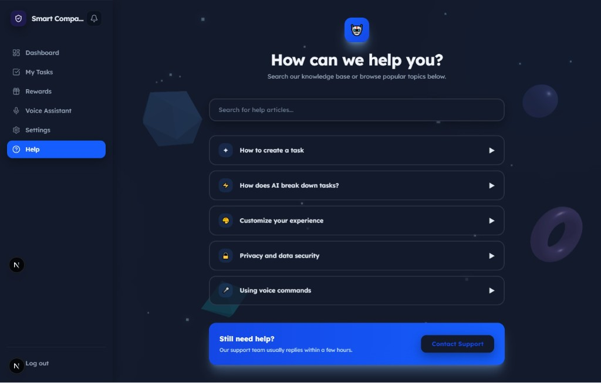

Grid of user cards with Total / Done / Active task counts pulled from Supabase `tasks`. Clicking a user opens a modal with tasks grouped by day, step-level progress, expandable step lists, and a **Remind** button that calls `sendReminder()` for incomplete tasks.

---

## 📁 Project Structure

```
src/
├── app/
│   ├── page.tsx              # Landing page
│   ├── login/                # User & admin authentication
│   ├── profilesetup/         # Neuro-profile onboarding
│   ├── dashboard/            # User home
│   ├── mytask/               # Task list & AI breakdown
│   ├── taskinfo/             # Step-by-step task execution
│   ├── rewards/              # Gamification
│   ├── voice-assistant/      # Voice capture
│   ├── setting/              # User preferences
│   ├── help/                 # Support center
│   ├── about/                # About page
│   ├── features/             # Features page
│   ├── blog/                 # Blog
│   └── admin/                # Admin panel
├── components/               # Shared UI components
└── lib/                      # Supabase, gamification, AI helpers
```

---

## License

This project is private. All rights reserved.
